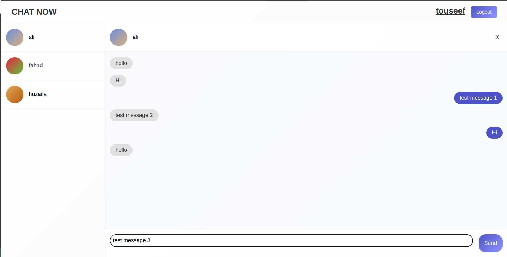

# Chatstreak - Instant messageing app

 

## Description

A simple yet powerful chat application for instant messaging using web socket technology. MySQL database is used for persistant storage of messages and user information. Routes are protected with the help of user authentication and authorization using json web tockens.

## Screenshots

1. Signup page

2. Login page

3. Home page when no user is selected

4. Home page when a user is selected

